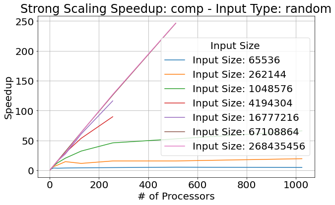
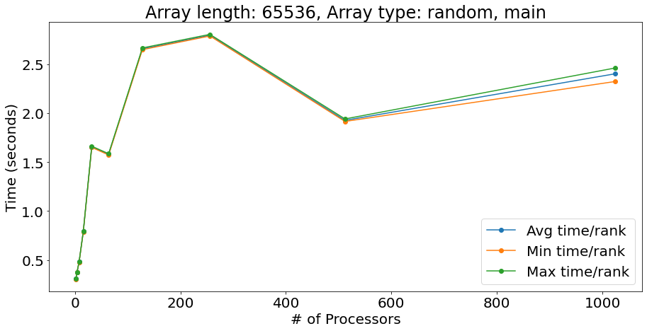
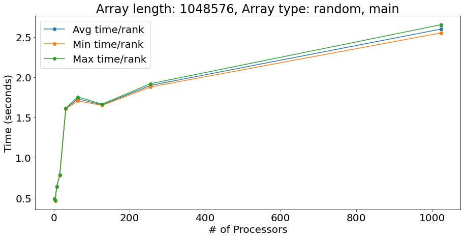
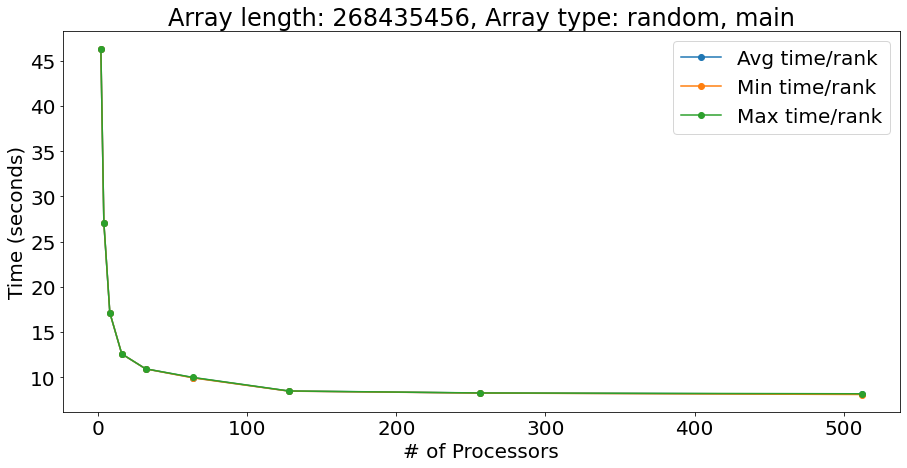

# CSCE 435 Group project

## 0. Group number:

5

## 1. Group members:

1. Amine Sakrout
2. Amol Gupta
3. Quenton Hua
4. Mohsin Khan
5. Oreoluwa Ogunleye-Olawuyi

### 1a. Communication

We will be working together using Discord and text to ensure everyone is up to date and able to continue working on the assignment.

## 2. Project topic (e.g., parallel sorting algorithms)

### 2a. Brief project description (what algorithms will you be comparing and on what architectures)

- Bitonic Sort: Bitonic Sort (Amol Gupta): Bitonic Sort is a parallel sorting algorithm that works by creating a bitonic sequence (a sequence that first increases and then decreases). The algorithm recursively sorts the sequence by comparing and swapping elements to form the bitonic sequence, and then merges the sequence to produce a sorted list. To parallelize Bitonic Sort with OpenMPI, the dataset will be divided into smaller sub-sequences, each assigned to different processors. Each processor independently will then sort its sub-sequence into a bitonic sequence, and then the sequences will be merged in parallel to yield a fully sorted list.
- Sample Sort: This algorithm splits up the dataset into smaller sample sizes and sorts these smaller groups using something like merge or quick sort. This sorting can be parallelized using OpenMPI to speed up this process. Once these groups are sorted they are merged together to yeild a fully sorted list.
- Merge Sort (Quenton Hua): Merge Sort is a sorting algorithm that recursively divides a list into two halves, sorts each half, and merges the sorted halves to produce a sorted list. To parallelize Merge Sort with OpenMPI, the dataset will be divided into smaller chunks, each assigned to different processors. Each processor sorts its chunk independently which is then merged in parallel.
- Radix Sort (Mohsin Khan): This algorithm processes the dataset by sorting elements based on individual digits, starting from the least significant digit. The sorting of each digit can be parallelized using OpenMPI to speed up the process. After each digit is sorted, the data is redistributed across processes to ensure the correct order for the next digit. Once all digits have been processed, the result is a fully sorted list.

- Column Sort: is a parallel sorting algorithm for sorting multi-dimensional data in a matrix. The unsorted input array is split among multiple processors. Each processor sorts its own column of data. The matrix is transposed, so each processor now sorts its row. The matrix is transposed back to its original form, and the processor sort again, giving a fully sorted matrix.

### 2b. Pseudocode for each parallel algorithm

- For MPI programs, include MPI calls you will use to coordinate between processes
- Bitonic Sort-

```
function bitonicSort(arr, low, cnt, dir):
    if cnt > 1:
        k = cnt / 2
        bitonicSort(arr, low, k, 1)  // Sort in ascending order
        bitonicSort(arr, low + k, k, 0)  // Sort in descending order
        bitonicMerge(arr, low, cnt, dir)

function bitonicMerge(arr, low, cnt, dir):
    if cnt > 1:
        k = cnt / 2
        for i = low to low + k - 1:
            if (dir == (arr[i] > arr[i + k])):
                swap(arr[i], arr[i + k])
        bitonicMerge(arr, low, k, dir)
        bitonicMerge(arr, low + k, k, dir)

function parallelBitonicSort(arr):
    // Initialize MPI
    MPI_Init()
    rank = MPI_Comm_rank()
    size = MPI_Comm_size()

    // Divide the array into sub-sequences
    local_arr = divideArray(arr, size, rank)

    // Perform bitonic sort on local sub-sequence
    bitonicSort(local_arr, 0, length(local_arr), 1)

    // Gather sorted sub-sequences
    sorted_arr = MPI_Gather(local_arr, root=0)

    if rank == 0:
        // Merge sorted sub-sequences
        bitonicMerge(sorted_arr, 0, length(sorted_arr), 1)

    // Finalize MPI
    MPI_Finalize()

    return sorted_arr if rank == 0 else None
```

- Sample Sort-

```
def parallel_sample_sort()
    initialize_parallel_environment()

    num_procs = get_num_processors()
    rank = get_processor_rank()

    MPI_Init(&argc, &argv);
    dataset = [provided data]
    gathered_samples = gather_samples_from_all_processors(dataset) #Split data
    if (rank == ROOT) {
        splitters = select_splitters(gathered_samples, num_procs) #Split collected data among all processors
    }
    exchanged_data = parallel_merge_sort(splitters) #Sort individual samples on parallel processors using merge sort
    local_sorted_data = merge_received_partitions(exchanged_data) #Combine results and sort

    global_sorted_data = gather_sorted_data(local_sorted_data) #Clean up returned data

return global_sorted_data

```


- Radix Sort-

```
Initialize MPI environment
MPI_Init()

Get rank of current process and the total number of processes
MPI_Comm_rank(MPI_COMM_WORLD, &rank)
MPI_Comm_size(MPI_COMM_WORLD, &size)

Master process initializes the data array if rank == 0 (master process)
if rank == 0 THEN
    Initialize the fullArray with N elements
end if

Broadcast the size of the data (N) to all processes using MPI_Bcast
MPI_Bcast(&N, 1, MPI_INT, 0, MPI_COMM_WORLD)

Divide the data into chunks for each process
subArraySize = N / size
Allocate memory for subArray of size subArraySize

Use MPI_Scatter to distribute parts of the full array from the master process to each process
MPI_Scatter(fullArray, subArraySize, MPI_INT, subArray, subArraySize, MPI_INT, 0, MPI_COMM_WORLD)

Find the maximum number in the local subArray to determine the number of digits
local_max = find_max(subArray)
Use MPI_Allreduce to find the global maximum value across all processes
MPI_Allreduce(&local_max, &global_max, 1, MPI_INT, MPI_MAX, MPI_COMM_WORLD)

For each digit (starting from the least significant digit) until the most significant digit:
exp = 1
while global_max / exp > 0 do

    Perform counting sort on the current digit (exp) for the local subArray
    local_counting_sort(subArray, subArraySize, exp)

    Redistribute the data among processes based on the current digit using MPI_Alltoall
    MPI_Alltoall(local_data, subArraySize, MPI_INT, received_data, subArraySize, MPI_INT, MPI_COMM_WORLD)

    Update subArray with redistributed received_data for the next round
    subArray = received_data

    exp = exp * 10
end while

Optionally, gather all sorted subarrays at the master process using MPI_Gather
if rank == 0 THEN
    MPI_Gather(subArray, subArraySize, MPI_INT, fullArray, subArraySize, MPI_INT, 0, MPI_COMM_WORLD)
end if

Master process prints the fully sorted array
if rank == 0 THEN
    print sorted fullArray
end if

Finalize MPI environment
MPI_Finalize()
```

- Column Sort-

```
Input: A matrix M with n x n elements where n  is the total number of elements distributed among p processors
Output: A fully sorted matrix

  1. Distribute the matrix rows among processes using `MPI_Scatter`.
  2. Repeat these steps until sorted:
     - for each column in the local matrix:
       - Sort the column elements in ascending order.
     - Transpose the local matrix (rows become columns and columns become rows).
     - for each row in the local submatrix:
       - Sort the row elements in ascending order.
     - Use `MPI_Alltoall` to exchange rows among processes.
     - After each exchange, each process will have a subset of rows in the correct order.
     - Transpose the local submatrix again to get the original form.
     - for each column in the local submatrix:
       - Sort the column elements in ascending order.
  3. Gather all submatrices from processes into the root process using `MPI_Gather`.
  4. If the current process is the root process:
     - Print the fully sorted matrix.
  5. Finalize the MPI environment using `MPI_Finalize`.
```

- Merge Sort-

```
function parallelMerge(subArray, subArraySize, rank, size):
       Perform parallel merging in a tree
       step = 1
       while step < size do
           if rank % (2 * step) == 0 then
               // Check if the neighboring process (rank + step) exists
               if rank + step < size then
                      // Receive the sorted sub-array from the neighboring process
                      MPI_Recv(receive_buffer, subArraySize, MPI_INT, rank + step, 0, MPI_COMM_WORLD, MPI_STATUS_IGNORE)

                      // Merge the received sub-array with the local sub-array
                      mergedArray = merge(subArray, receive_buffer)

                      // Update local sub-array with the merged result
                      subArray = mergedArray
                      subArraySize = subArraySize * 2
               end if
           else
               // Send the local sorted sub-array to the neighboring process (rank - step)
               MPI_Send(subArray, subArraySize, MPI_INT, rank - step, 0, MPI_COMM_WORLD)
               // Exit the loop once the array is sent
               break
           end if
           // Move to the next step in the merging process
           step = step * 2
       end while
```

- Column Sort:

### 2c. Evaluation plan - what and how will you measure and compare

- Input sizes, Input types: We will use various input sizes to evaluate the performance of each parallel sorting algorithm. The input sizes will follow powers of two: `2^16, 2^18, 2^20, 2^22, 2^24, 2^26, 2^28`.
- Strong scaling (same problem size, increase number of processors/nodes): We will measure **strong scaling** by fixing the input size and increasing the number of processors. We will evaluate how the runtime changes as we increase the number of MPI processes from `2, 4, 8, 16, 32, 64, 128, 256, 512, to 1024` for the same input sizes. This will help us determine how well the algorithms use additional processors. Furthermore, we will test this logic on four different kinds of input: sorted, random, reverse sorted and 1% permutation.
- Weak scaling (increase problem size, increase number of processors): We will increase the problem size and the number of processors proportionally, aiming to keep the workload per processor constant. By comparing the runtimes as we increase both input size and number of processors, we can evaluate the algorithms' ability to handle larger datasets without increasing the per-processor workload. Furthermore, we will test this logic on four different kinds of input: sorted, random, reverse sorted and 1% permutation.

### 3a. Caliper instrumentation

We are using 2^16 or 65536 values that make up the total array length along with using 32 processors. 

- Merge Sort Calltree: 
```
└─ 9.446 main
   ├─ 8.979 MPI_Comm_dup
   ├─ 0.000 MPI_Finalize
   ├─ 0.000 MPI_Finalized
   ├─ 0.000 MPI_Initialized
   ├─ 0.390 comm
   │  ├─ 0.164 comm_large
   │  │  ├─ 0.023 MPI_Gather
   │  │  └─ 0.140 MPI_Scatter
   │  └─ 0.227 comm_small
   │     └─ 0.226 MPI_Barrier
   ├─ 0.021 comp
   │  ├─ 0.021 comp_large
   │  └─ 0.000 comp_small
   ├─ 0.054 correctness_check
   │  ├─ 0.047 MPI_Bcast
   │  └─ 0.007 MPI_Gather
   └─ 0.000 data_init_runtime
```

- Bitonic sort Calltree:
```
7.322 main
├─ 0.000 MPI_Init
└─ 6.781 main
   ├─ 6.518 MPI_Comm_dup
   ├─ 0.000 MPI_Finalize
   ├─ 0.000 MPI_Finalized
   ├─ 0.000 MPI_Initialized
   ├─ 0.090 comm
   │  ├─ 0.074 MPI_Barrier
   │  ├─ 0.010 MPI_Scatter
   │  └─ 0.005 comm_large
   │     └─ 0.005 MPI_Gather
   ├─ 0.172 comp
   │  └─ 0.172 comp_large
   ├─ 0.012 correctness_check
   └─ 0.091 data_init_runtime
```
- Radix sort Calltree:
```
0.451 main
├─ 0.001 MPI_Barrier
├─ 0.004 MPI_Bcast
├─ 0.001 MPI_Comm_dup
├─ 0.000 MPI_Finalize
├─ 0.000 MPI_Finalized
├─ 0.000 MPI_Init
├─ 0.000 MPI_Initialized
├─ 0.003 Sorting loop
│  ├─ 0.003 comm
│  │  └─ 0.003 comm_large
│  │     ├─ 0.001 MPI_Alltoall
│  │     ├─ 0.001 MPI_Alltoallv
│  │     └─ 0.000 MPI_Barrier
│  └─ 0.001 comp
│     └─ 0.000 MPI_Barrier
├─ 0.009 comm
│  ├─ 0.000 MPI_Allreduce
│  ├─ 0.000 MPI_Barrier
│  ├─ 0.001 comm_large
│  │  ├─ 0.000 MPI_Barrier
│  │  └─ 0.001 MPI_Gather
│  └─ 0.008 comm_small
│     ├─ 0.008 MPI_Barrier
│     └─ 0.000 MPI_Scatter
├─ 0.008 comp
│  └─ 0.008 comp_small
│     └─ 0.008 MPI_Barrier
├─ 0.001 correctness_check
│  ├─ 0.000 MPI_Barrier
│  ├─ 0.001 MPI_Bcast
│  └─ 0.000 MPI_Gather
└─ 0.000 data_init_runtime
```
- Sample Sort:
```1.629 main
├─ 0.000 MPI_Init
├─ 0.000 data_init_X
├─ 0.069 comm
│  ├─ 0.053 comm_small
│  │  └─ 0.053 MPI_Bcast
│  └─ 0.016 comm_large
│     ├─ 0.016 MPI_Scatter
│     └─ 0.000 MPI_Gather
├─ 0.001 comp
│  └─ 0.001 comp_large
├─ 0.000 correctness_check
│  ├─ 0.000 MPI_Gather
│  └─ 0.000 MPI_Bcast
├─ 0.000 MPI_Finalize
├─ 0.000 MPI_Initialized
├─ 0.000 MPI_Finalized
└─ 0.001 MPI_Comm_dup
```


## 4. Performance evaluation

### 1. Merge Sort:
#### 4.1a


These plot show the speedup x # of processors for main, comm, and comp_large. From these plots we can see that the smaller array sizes benefit the least with smaller speedups. The speedups within main actually tend to decrease with more processors, this is due to the communication overhead as seen in the comm graph. The speedup for comm exponentially decreases with increased processors, plateauing with higher processors. This would make sense as more processors would be used hence more communication to allocate parts of the array would be required. For the comp_large the speedup increases with more processors, this makes sense as the computation load decreases per processors as its distributed among more processors. The smaller array actually benefits the most for comp_large with increased processors, this could be due to the fact that it requires less merging and swapping for a smaller array.


In these graphs, we observe the performance of the merge sort algorithm for different input types: perturbed, random, reverse, and sorted. The first two graphs show that random input consistently results in the worst performance, with a sharp increase in time as the input size grows. Perturbed input behaves similarly but is slightly better than random. Sorted and reverse inputs, on the other hand, remain the most efficient, especially for larger input sizes, where their performance growth is more gradual. The third graph shows minimal variation between input types when handling smaller inputs, likely indicating that all types are processed quickly and similarly in smaller data sets. As the data size grows, random input clearly performs the worst likely due to the nature of the merge sort algorithm which would require merging and swapping elements for elements that are not sorted.
#### 4.1c


The plots show the average, minimum, and maximum time per rank using a merge sort algorithm. The maximum time initially spikes higher than both the average and minimum times which could indicate a communication bottlenecks among ranks. As the array size increases, the gap between the minimum and maximum times narrows, suggesting improved load balancing with larger inputs. However, the maximum time remains consistently higher, which points to certain ranks taking longer most likely due to communication overhead.

### 1. Radix Sort:
#### 4.1a




blah


blah

#### 4.1c







blah


Include detailed analysis of computation performance, communication performance.
Include figures and explanation of your analysis.

### 4a. Vary the following parameters

For input_size's:

- 2^16, 2^18, 2^20, 2^22, 2^24, 2^26, 2^28

For input_type's:

- Sorted, Random, Reverse sorted, 1%perturbed

MPI: num_procs:

- 2, 4, 8, 16, 32, 64, 128, 256, 512, 1024

This should result in 4x7x10=280 Caliper files for your MPI experiments.

### 4b. Hints for performance analysis

To automate running a set of experiments, parameterize your program.

- input_type: "Sorted" could generate a sorted input to pass into your algorithms
- algorithm: You can have a switch statement that calls the different algorithms and sets the Adiak variables accordingly
- num_procs: How many MPI ranks you are using

When your program works with these parameters, you can write a shell script
that will run a for loop over the parameters above (e.g., on 64 processors,
perform runs that invoke algorithm2 for Sorted, ReverseSorted, and Random data).

### 4c. You should measure the following performance metrics

- `Time`
  - Min time/rank
  - Max time/rank
  - Avg time/rank
  - Total time
  - Variance time/rank

## 5. Presentation

Plots for the presentation should be as follows:

- For each implementation:
  - For each of comp_large, comm, and main:
    - Strong scaling plots for each input_size with lines for input_type (7 plots - 4 lines each)
    - Strong scaling speedup plot for each input_type (4 plots)
    - Weak scaling plots for each input_type (4 plots)

Analyze these plots and choose a subset to present and explain in your presentation.

## 6. Final Report

Submit a zip named `TeamX.zip` where `X` is your team number. The zip should contain the following files:

- Algorithms: Directory of source code of your algorithms.
- Data: All `.cali` files used to generate the plots seperated by algorithm/implementation.
- Jupyter notebook: The Jupyter notebook(s) used to generate the plots for the report.
- Report.md
